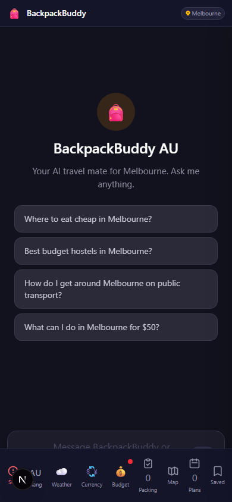
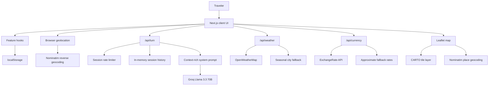

# BackpackerAI

> A voice-first AI travel companion for backpackers exploring Australia.

[](https://nextjs.org/)
[](https://react.dev/)
[](https://www.typescriptlang.org/)
[](https://tailwindcss.com/)

BackpackerAI powers **BackpackBuddy AU**, a mobile-oriented travel assistant that combines voice input, spoken responses, AI-generated recommendation cards, maps, weather, budget tracking, emergency information, itinerary planning, packing support, currency conversion, and Australia-specific cultural guidance.

The project is intentionally lightweight: no auth system, no database, and no long-lived user account. A small set of Next.js API routes protects server-side API keys while the browser owns user state through `localStorage`.

## Product Screenshot

Real local mobile viewport run of the Next.js app. The screenshot uses the bundled city/weather/map fallback paths; live AI responses require `GROQ_API_KEY`.



## Why This Matters

Travel apps often split core backpacker workflows across search, maps, weather, notes, currency tools, emergency pages, and transit guides. BackpackerAI explores a more cohesive interface: ask in natural language, receive actionable cards, save useful answers, map places, keep a budget, and export a trip plan from the same screen.

For reviewers, the repository demonstrates full-stack product thinking:

- Clear separation between UI state, reusable hooks, API proxies, prompt construction, and static domain data.
- Streamed LLM integration with response validation, JSON repair, retry handling, and rate limiting.
- Practical offline-first decisions for safety, packing, slang, and culture data.
- Client-side persistence without introducing unnecessary infrastructure.
- CI-backed lint, typecheck, and production build verification.

## Product Positioning

BackpackerAI is built for first-time and budget-conscious travelers in Australia who need direct, local, and practical answers:

- "What is cheap near me right now?"
- "How do I get from Circular Quay to Bondi?"
- "What should I do in Melbourne if it is raining?"
- "How much have I got left today?"
- "What emergency number do I call?"

The assistant keeps the experience focused on Australia, backpacker constraints, weather context, remaining budget, and optional GPS-derived locality.

## Feature Highlights

### AI Travel Assistant

- Voice input through the browser Web Speech API.
- Text fallback for browsers without speech recognition.
- Text-to-speech responses through `SpeechSynthesis`.
- Groq-powered Llama 3.3 70B responses via `/api/turn`.
- Server-sent event streaming from the API route to the client.
- Structured response schema with assistant text, spoken script, follow-up prompt, and typed recommendation cards.
- JSON extraction, schema validation, JSON repair fallback, retry handling, and user-facing fallback response.

### Recommendation Cards

- AI responses become reusable cards with typed categories: `eat`, `stay`, `transport`, `plan`, and `essentials`.
- Cards can be saved, removed, shared, and imported into the itinerary builder.
- Card text is parsed for place names so locations can be geocoded and plotted on the map.

### Map Experience

- Interactive map powered by `react-leaflet`, Leaflet, and OpenStreetMap/CARTO tiles.
- 49 bundled popular-place pins across supported Australian cities.
- Chat-derived locations are geocoded through Nominatim and rendered as colored pins.
- The map and chat are kept mounted and swapped with stacking/opacity so Leaflet does not initialize inside `display: none`.

### Weather-Aware Recommendations

- `/api/weather` fetches OpenWeatherMap current conditions and 3-hour forecast data.
- Forecast data is grouped into daily high/low, rain chance, humidity, wind, and icon summaries.
- Weather responses are cached server-side for 30 minutes.
- Seasonal fallback data is bundled for major Australian cities when no OpenWeatherMap key is configured or the API is unavailable.
- Weather advice is injected into the LLM prompt so recommendations can adapt to rain, heat, cold, or clear conditions.

### Budget Tracking

- Daily AUD budget presets plus custom budget entry.
- Expense logging by category: food, accommodation, transport, activities, and other.
- Remaining budget is persisted in `localStorage`.
- A new day keeps the budget amount and resets expenses.
- Budget context is sent to the AI so low remaining spend can bias recommendations toward free or cheap options.

### GPS "Near Me"

- Browser geolocation with high-accuracy request settings and timeout handling.
- Five-minute client-side cache for the last known position.
- Reverse geocoding through Nominatim to derive suburb/neighborhood/city context.
- The app auto-submits a locality-aware "What's near me?" request after GPS lookup.

### Safety And Travel Utilities

- SOS panel with Australian emergency numbers and tap-to-call links.
- Embassy/high commission contact data for 23 nationalities.
- City-specific scam warnings for supported cities.
- Wildlife and sun-safety guidance stored locally.
- Google Maps hospital search link.
- 67-entry Aussie slang guide plus culture tips.
- 44-item Australia-specific packing checklist with custom items and progress tracking.
- Currency converter for AUD to 25 popular currencies, backed by ExchangeRate-API with approximate fallback rates.
- Day-by-day itinerary builder with saved-card import, assignment, reordering, export, native share, and clipboard fallback.

## Tech Stack

| Area | Implementation |
| --- | --- |
| Framework | Next.js 16 App Router |
| UI | React 19, TypeScript, Tailwind CSS v4 |
| AI | Groq Cloud chat completions, `llama-3.3-70b-versatile` |
| Streaming | Native `fetch`, `ReadableStream`, server-sent event parsing |
| Voice | Browser Web Speech APIs: `SpeechRecognition`, `SpeechSynthesis` |
| Maps | Leaflet, `react-leaflet`, OpenStreetMap/Nominatim, CARTO tiles |
| Weather | OpenWeatherMap API with seasonal fallback |
| Currency | ExchangeRate-API with approximate fallback rates |
| Persistence | Browser `localStorage` plus in-memory server session state |
| Quality | ESLint, TypeScript `--noEmit`, Next production build, GitHub Actions CI |

## Architecture



### Request Flow

1. The traveler speaks or types a question.
2. The client sends the transcript, session id, selected city, weather advice, budget context, and optional GPS context to `/api/turn`.
3. The API route rate-limits by session, updates in-memory session history, builds a system prompt, and streams Groq output.
4. The route validates the final JSON payload and attempts a repair call if the model output is malformed.
5. The client renders assistant text, speaks the response when supported, and displays recommendation cards.
6. Saved cards can feed the map, itinerary builder, native share sheet, and clipboard export paths.

### Server-Side API Routes

- `app/api/turn/route.ts` - Groq proxy, SSE stream, prompt context, response validation, JSON repair, retry, fallback response, session memory, and rate limiting.
- `app/api/weather/route.ts` - OpenWeatherMap proxy, daily forecast aggregation, 30-minute cache, seasonal city fallback, and 502 response when unavailable.
- `app/api/currency/route.ts` - ExchangeRate-API proxy, six-hour cache, approximate rates without an API key, and stale-cache fallback on upstream failure.

## Quality Signals

- TypeScript is used across the app, hooks, API routes, and shared domain types.
- CI runs on pull requests and pushes to `main`.
- GitHub Actions uses `.nvmrc`, `npm ci`, `npm run lint`, `npm run typecheck`, and `npm run build`.
- API keys are read only from server-side environment variables.
- LLM output is treated as untrusted data and validated before rendering as structured cards.
- The LLM route has a per-session in-memory request limiter: 20 requests per minute.
- Weather and currency routes cache upstream responses to reduce latency and API pressure.
- Static emergency, packing, slang, city, and map data keep key travel utilities available without a database.

## Project Structure

```text
BackpackerAI/
├── .github/workflows/ci.yml        # Lint, typecheck, and build workflow
├── app/
│   ├── api/
│   │   ├── currency/route.ts       # AUD exchange-rate proxy and fallback
│   │   ├── turn/route.ts           # Groq LLM proxy and SSE stream
│   │   └── weather/route.ts        # Weather proxy, cache, and fallback
│   ├── globals.css                 # Tailwind v4 global styles
│   ├── layout.tsx                  # App shell metadata
│   └── page.tsx                    # Main client application
├── components/                     # Panels, cards, navigation, map, and utilities
├── hooks/                          # Browser APIs, localStorage, weather, budget, itinerary
├── lib/                            # Prompting, shared types, static data, helpers
├── public/                         # Static assets
├── .env.example                    # Required and optional environment variables
├── .nvmrc                          # Node version used by CI
├── eslint.config.mjs               # ESLint configuration
├── next.config.ts                  # Next.js configuration
├── package.json                    # Scripts and dependencies
└── tsconfig.json                   # TypeScript configuration
```

## Getting Started

### Prerequisites

- Node.js 20.9 or newer. The repo pins Node `20.19.0` in `.nvmrc`.
- npm.
- A Groq API key for AI responses.
- Optional OpenWeatherMap and ExchangeRate-API keys for live weather and currency data.

### Install

```bash
git clone https://github.com/KarthikRamesh9149/BackpackerAI.git
cd BackpackerAI
npm install
```

### Configure Environment

Create `.env.local` in the project root:

```env
GROQ_API_KEY=your_groq_api_key_here
OPENWEATHERMAP_API_KEY=your_openweathermap_api_key_here
EXCHANGE_RATE_API_KEY=your_exchange_rate_api_key_here
```

Environment variables:

| Variable | Required | Used by | Behavior when missing |
| --- | --- | --- | --- |
| `GROQ_API_KEY` | Yes | `/api/turn` | AI route returns `500` with `GROQ_API_KEY not configured`. |
| `OPENWEATHERMAP_API_KEY` | No | `/api/weather` | Uses bundled seasonal estimates for supported Australian cities. |
| `EXCHANGE_RATE_API_KEY` | No | `/api/currency` | Returns approximate fallback rates. |

### Run Locally

```bash
npm run dev
```

Open [http://localhost:3000](http://localhost:3000).

Microphone, speech, share-sheet, clipboard, and geolocation features depend on browser support and permissions. Text input remains available when voice input is unsupported.

### Production Build

```bash
npm run build
npm start
```

## Scripts

| Command | Purpose |
| --- | --- |
| `npm run dev` | Start the Next.js development server. |
| `npm run build` | Create a production build. |
| `npm start` | Serve the production build. |
| `npm run lint` | Run ESLint. |
| `npm run typecheck` | Run TypeScript with `--noEmit`. |
| `npm test` | Alias for `npm run typecheck`. |
| `npm run check` | Run lint, typecheck, and build in sequence. |

## Testing And CI

There is no dedicated unit or end-to-end test suite in this repository yet. The current test signal is static and build verification:

```bash
npm run lint
npm run typecheck
npm run build
```

CI runs the same lint/typecheck/build sequence through `.github/workflows/ci.yml` on pull requests and pushes to `main`.

## Security And Privacy Notes

- API keys stay server-side in Next.js route handlers and should never be committed.
- `.env.example` documents required variable names without secrets.
- The app does not include authentication, a database, analytics, or a user account system.
- Saved cards, packing items, budget data, home currency, and nationality selection are stored in the browser via `localStorage`.
- Conversation history for the AI route is kept in an in-memory server map for up to one hour and trimmed to the last 10 messages.
- The rate limiter is in-memory and scoped by client-supplied session id, so it is useful for basic abuse control but not a hardened production quota system.
- Geolocation is requested only after the user activates the "Near Me" flow. Coordinates may be sent to Nominatim for reverse geocoding and to the LLM route as prompt context.
- Emergency and safety information is bundled for convenience and should not replace official emergency services or local authority guidance.

## Browser Support

| Capability | Notes |
| --- | --- |
| Voice input | Requires browser support for `SpeechRecognition`; Firefox support is limited. |
| Voice output | Uses `SpeechSynthesis` where available. |
| Geolocation | Requires HTTPS or localhost and user permission in modern browsers. |
| Native share | Uses `navigator.share` with clipboard fallback. |
| Clipboard | Requires browser permission and secure context in some browsers. |
| Map | Requires network access to map tiles and Nominatim geocoding. |

## Troubleshooting

### `GROQ_API_KEY not configured`

Create `.env.local`, add `GROQ_API_KEY`, and restart the dev server. Next.js only loads new environment variables at process start.

### Weather shows seasonal estimates

This is expected when `OPENWEATHERMAP_API_KEY` is missing, inactive, rate-limited, or unavailable. Add a valid key and restart the dev server for live weather.

### Currency rates look approximate

Without `EXCHANGE_RATE_API_KEY`, the app returns bundled approximate rates. Add a valid ExchangeRate-API key for live AUD conversion.

### Microphone does not start

Use a browser with Web Speech API support, allow microphone permissions, and run on `localhost` or HTTPS. The text input path still works without microphone access.

### GPS does not return a suburb

The browser may block location, the request may time out, or Nominatim may not return suburb-level data for the coordinate. The app can still use city-level context.

### Map looks empty or markers are missing

Check network access to CARTO tiles and Nominatim. Chat-derived markers only appear when AI card bullets contain a recognizable place name before a dash.

## Roadmap And Limitations

Planned or natural next improvements:

- Add unit tests for route validation, prompt context, localStorage hooks, and map parsing helpers.
- Add Playwright coverage for the main user flows: ask, save, map, budget, itinerary, share, and SOS.
- Replace in-memory session storage and rate limiting with durable storage for production deployments.
- Add stronger schema validation with a dedicated runtime validator.
- Add live transit data where available instead of relying on model knowledge.
- Add richer accessibility coverage for voice-first and mobile interactions.
- Add production deployment screenshots or a short demo video once the app is hosted.

Current limitations:

- AI place, price, schedule, and transport suggestions can be wrong or outdated and should be checked against official sources.
- The LLM route requires Groq; without `GROQ_API_KEY`, the assistant cannot answer.
- Server memory resets on redeploys, cold starts, and process restarts.
- No database means user data is browser-local and will not sync across devices.
- Speech recognition and native sharing vary significantly by browser.
- The repository does not currently include screenshots or a deployed demo URL.

## License

No license file is currently included in this repository.
